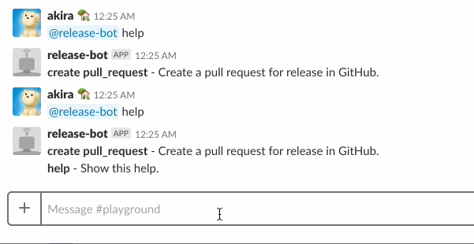

# ReleaseBot

ReleaseBot is a slack bot to create pull request for release.





## Usage

Please clone this repository.

```
$ git clone https://github.com/h3poteto/ex_release_bot.git
$ cd ex_release_bot
```
And you must configure environment variables:

```
export SLACK_API_TOKEN=xoxb-hogehoge
export BASE_BRANCH=master
export RELEASE_BRANCH=release
export OWNER=h3poteto
export REPOSITORY=ex_release_bot
export GITHUB_TOKEN=fugafuga
```

If you using direnv, I prepared `.envrc.sample` so please copy and update it.
After that, you can run.

```
$ mix deps.get
$ mix run --no-halt
Connected as UCV369R54
```


## License

The software is available as open source under the terms of the [MIT License](https://opensource.org/licenses/MIT).
